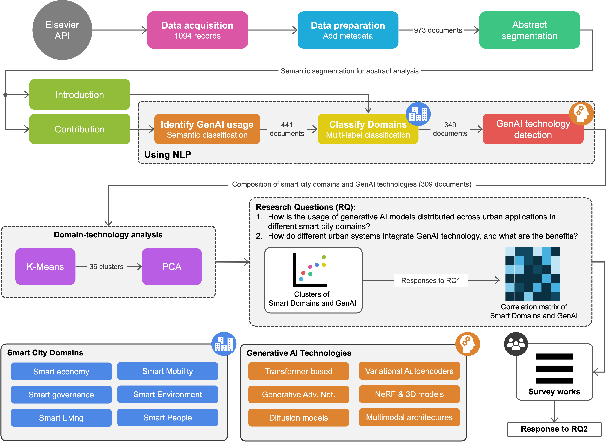

# On the Role of AI in Building Generative Urban Intelligence

This study explores the applications, impacts, challenges, and promising future trends of Generative Artificial Intelligence (GenAI) within the context of smart cities, discussing generative urban intelligence perspectives for simulating alternative urban scenarios, co-designing infrastructure prototypes, and improving service delivery. It provides a pioneering perspective on an underexplored field that is expected to transform urban design, planning, and management.

We developed a reproducible framework grounded in peer-reviewed literature and systematic Natural Language Processing (NLP) analytical approach. The framework is designed to facilitate the identification of GenAI applications in smart cities, enabling to systematically explore the potential of generative models in urban contexts.

---



## Key Features

-   **Systematic Review:** NLP-based analysis of approximately 1000 articles.
-   **Domain-Specific Insights:** A comprehensive taxonomy of GenAI applications in smart cities.
-   **Reproducible Analysis:** Code and data are structured for reuse and verification.

---

## Article Information

If you reference this work in a scientific context, please cite this paper:

[TBD]

## Repository Structure

```plaintext
.
├── README.md                # Project overview and instructions
├── config/                  # Configuration files for the analysis
├── data/                    # Datasets generated in the study
├── manuscript/              # Manuscript and related documents
├── model/                   # Models training notebooks for analysis
├── notebooks/               # Jupyter notebooks for analysis
├── results/                 # Output files and analysis results
```

## Contact Information

For questions or collaboration, please contact:  
**João Carlos N. Bittencourt**  
Email: [joaocarlos@ufrb.edu.br](mailto:joaocarlos@ufrb.edu.br)

**Daniel G. Costa**  
Email: [danielgcosta@fe.up.pt](mailto:danielgcosta@fe.up.pt)
